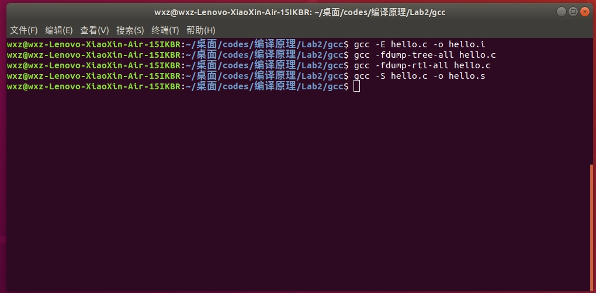

# 实验报告

## 一、实验目的

本实验的目的是了解工业界常用的编译器 GCC 和 LLVM,熟悉编译器的安装
和使用过程,观察编译器工作过程中生成的中间文件的格式和内容,了解编译器
的优化效果,为编译器的学习和构造奠定基础。

## 二、实验内容

本 实验主要的内容为在 Linux 平台上安装和运行工业界常用的编译器 GCC 和
LLVM,如果系统中没有安装,则需要首先安装编译器,安装完成后编写简单的测
试程序,使用编译器编译,并观察中间输出结果。

## 三、实验步骤

### 1、编译器安装

本实验在Linux系统下进行。通过使用相应的命令，使用Linux系统的程序管理器，即可快速完成对实验环境的搭建。使用Visual Studio code作为实验代码的编辑器。通过使用相关的命令，使用apt-get包管理器完成实验所需的gcc、LLVM、clang环境安装。相关环境的安装命令如下

1. gcc环境 ：sudo apt-get install build-essential
2. LLVM环境：sudo apt-get install llvm
3. clang环境：sudo apt-get install clang

在执行上述语句后，即可完成对实验环境的搭建。通过相关安装完成提示，可以查看安装的编译环境版本。

### 2、编写测试程序

以实验1中，对数组排序的代码作为本次的主要实验代码。由于实验中要求完成对单文件、多文件的代码进行编写，因此在实验1的基础上，将qsort函数抽取至qsort.h、qsort.c文件中，作为编译多个文件的实验代码。对于查看编译器中间处理结果的测试代码，为了便于观察，使用简单的”Hello，world“程序作为测试程序。这里分别针对gcc、llvm编译器将测试程序命名为hello.c、test.c。对于性能测试方面，另编写

### 3、实验操作

对于gcc编译器，按照如下步骤完成实验操作：

1. 查看编译器的版本：gcc --version
2. 使用编译器编译单个文件：gcc main.c -o main
3. 使用编译器编译链接多个文件：gcc qsort.c main.c -o main
4. 查看预处理结果: gcc -E hello.c -o hello.i
5. 查看语法分析树：gcc -fdump-tree-all hello.c
6. 查看中间代码生成结果: gcc -fdump-rtl-all hello.c
7. 查看生成的目标代码(汇编代码)：gcc –S hello.c –o hello.s

对于 LLVM 编译器,按如下步骤完成:

1. 查看编译器的版本：clang --version、llc -version
2. 使用编译器编译单个文件：clang main.c -o main
3. 使用编译器编译链接多个文件：clang qsort.c main.c -o main
4. 查看编译流程和阶段: clang -ccc-print-phases test.c -c
5. 查看词法分析结果: clang test.c -Xclang -dump-tokens
6. 查看词法分析结果 2:clang test.c -Xclang -dump-raw-tokens
7. 查看语义分析结果：clang test.c -Xclang -ast-dump
8. 查看语义分析结果 2：clang test.c -Xclang -ast-view
9. 查看编译优化的结果：clang test.c -S -mllvm -print-after-all
10. 查看生成的目标代码结果：Target code generation:clang test.c –S

在上述实验进行过程中，对编译器的运行结果进行保存、截图，并在每一步结束后对执行结果进行分析检查。

使用不同的编译参数，对两个编译器输入程序进行优化编译，并对比GCC、LLVM优化后的程序运行效率

## 四、GCC运行结果分析

### 1、查看编译器版本

上图为使用命令查看gcc编译器版本的结果。本次实验使用的gcc编译器版本为：gcc (Ubuntu 7.5.0-3ubuntu1~18.04) 7.5.0

### 2、使用编译器编译单个文件

如图，使用gcc编译器编译程序后，使用./main运行程序。程序正常运行，并输出了排序后的数组。程序运行正常，输出符合预期。

### 3、使用编译器编译多个文件

多个文件的程序结构如图所示，包含main.c、qsort.h、qsort.c三个文件。7.txt为排序用数据文件。
如图，使用gcc编译器编译多个文件后，使用./main运行程序。程序正常运行，并输出了排序后的数组。程序运行正常，输出符合预期。

### 4、查看预处理结果

执行命令：gcc -E hello.c -o hello.i后，编译器将预处理后的文件存储至hello.i中。经与源文件对比，源hello.c文件中，#include<stdio.h>的头文件被替换为一大段代码，而主程序部分被完整的的保留。

### 5、查看语法分析树

执行命令：gcc -fdump-tree-all hello.c后，编译器将语法分析结果输出至文件夹。这里包含24个文件，其中23个为语法分析树文件，1个为编译后的可执行文件。

### 6、查看中间代码生成结果

执行命令：gcc -fdump-rtl-all hello.c后，编译器将所有中间代码输出至文件夹。这里包含25个文件，其中24个为中间代码文件，1个为编译后的可执行文件。

### 7、查看生成的目标代码（汇编代码）

执行命令：gcc -S hello.c -o hello.s后，编译器将最终生成的汇编代码输出至文件夹。

## 五、LLVM运行结果分析

### 1、查看编译器版本

上图为使用命令查看编译器版本的结果。本次实验使用的LLVM编译环境中，clang版本：clang version 6.0.0-1ubuntu2，LLVM版本：LLVM version 6.0.0

### 2、使用编译器编译单个文件

使用命令：clang main.c -o main可以完成对单个文件的编译。从上图可以看到，程序正常运行，输出结果符合预期。

### 3、使用编译器编译链接多个文件

多个文件的程序结构如图所示，包含main.c、qsort.h、qsort.c三个文件。7.txt为排序用数据文件。
如图，使用llvm编译器编译多个文件后，使用./main运行程序。程序正常运行，并输出了排序后的数组。程序运行正常，输出符合预期。

### 4、查看编译流程和阶段

执行命令：clang -ccc-print-phases test.c -c后，在终端窗口输出程序编译执行的各个阶段，分别为：

0. 读取文件
1. 预处理器
2. 编译程序
3. 后端
4. 汇编程序

### 5、查看词法分析结果

执行命令：clang test.c -Xclang -dump-tokens后，在终端界面显示对程序执行此法分析后的结果。

### 6、查看词法分析结果2

执行命令：clang test.c -Xclang -dump-raw-tokens后，在终端界面显示对程序执行词法分析后的结果。此部分的词法分析可以清晰看到，针对test.c源文件中的每一个语法成分做了明确的属性标注和位置信息标注。每个语法成份的属性、所属文件、行号、列号均做了清晰标注。

### 7、查看语义分析结果

执行命令：clang test.c -Xclang -ast-dump后，编译器在终端输出对程序执行语义分析的结果。

### 8、查看语义分析结果2

执行命令：clang test.c -Xclang -ast-view后，编译器在终端输出对程序执行语义分析的结果。

### 9、查看编译优化的结果

执行命令：clang test.c -S mllvm -print-after-all后，编译器输出代码优化后的结果。

### 10、查看生成的目标代码结果

执行命令：clang test.c -S后，编译器会将生成的汇编代码保存至当前文件夹，并命名为test.s。

## 六、GCC与LLVM对比分析

### 1、特点对比

从使用上来看，gcc与LLVM并没有明显的区别。通过使用简单的命令，即可完成对单文件、多文件程序的编译，指定相应优化等级、输出目录等详细编译参数。

在编译器工作方式方面，gcc编译器在预处理之后，执行语法树分析，并形成大量语法分析树文件。在之后，执行中间代码生成，并进行多项代码优化操作。因此，在此分布也会形成大量的中间代码。最后，执行代码生成，形成最终的汇编代码。

而对于LLVM编译器，在预处理后，编译器先后进行词法分析、语法分析、语义分析和中间代码生成。这部分工作由LLVM的前端clang进行完成。之后由LLVM后端执行代码优化、生成目标代码等操作，并形成最终的目标汇编代码。

### 2、性能对比

上图为使用gcc编译器，进行不同优化等级优化编译的程序编译命令。

经测试，对5000000规模的数据进行排序，在-O0、-O1、-O2、-O3四个优化等级下，排序时间分别为：3.17 1.46 1.17 1.29。显然，优化-O2是执行速度最快的优化等级，它的执行速度甚至快于-O3。

0. 3.203999 3.180167 3.191086 3.223592 3.273963
1. 1.455040 1.477500 1.458391 1.496569 1.463941
2. 1.166163 1.204660 1.187566 1.177173 1.169733
3. 1.293478 1.313500 1.292953 1.307134 1.288223

上图为使用LLVM编译器，进行不同等级优化编译的程序编译命令。

经测试，对5000000规模的数据进行排序，在-O0、-O1、-O2、-O3四个优化等级下，排序时间分别为：3.04 1.07 1.09 1.08。优化-O1是执行速度最快的优化等级，它的执行速度也比-O3快。

0. 3.099347 3.034016 3.031169 3.025571 3.023625
1. 1.080175 1.084706 1.080149 1.084990 1.086492
2. 1.089277 1.089641 1.087473 1.089208 1.086991
3. 1.084862 1.094768 1.097186 1.081378 1.086087

从上面的对比可以看出，gcc、LLVM在O0的最低优化等级下的性能存在一定的差距。而在高优化等级下，gcc的程序运行最短时间约1.18s，LLVM的程序运行最短时间约为1.09s左右。这说明，gcc、LLVM在性能方面存在一定的差距。同时在对最终生成的汇编语言进行对比后发现，

## 七、心得体会

本次实验中，我使用gcc、LLVM两种C语言编译环境，对于单文件、多文件的c语言程序进行了编译，并对两种编译器对单文件程序的编译过程作了细致分析。可以看到，两种编译器在程序编译方面有较多的差异，在编译过程及编译器架构上均有不同。gcc是一款较为完善的标准编译器，在工业界有较为广泛的应用。而LLVM则是一种编译器的框架，对于不同的语言，使用不同的前端生成相同的中间代码；而对于不同的及其平台，则使用不同的后端，生成运行在不同平台上运行的代码。在本次编译中使用的clang，就是LLVM的前端。在性能方面，经查阅相关资料，LLVM的性能、安全性等都较gcc有一定优势。在具体其它细节方面，也有较多的差距。

经过本次实验，我对gcc、LLVM两种编译器有了更深入的了解。对于编译器的工作过程和中间文件有了更多的了解和认识。对这两款编译器的架构和特点也有了进一步的了解。在以后的学习中，我要进一步了解和学习以上两款经典编译器的特点和原理，为编译器的学习和构造奠定基础。
